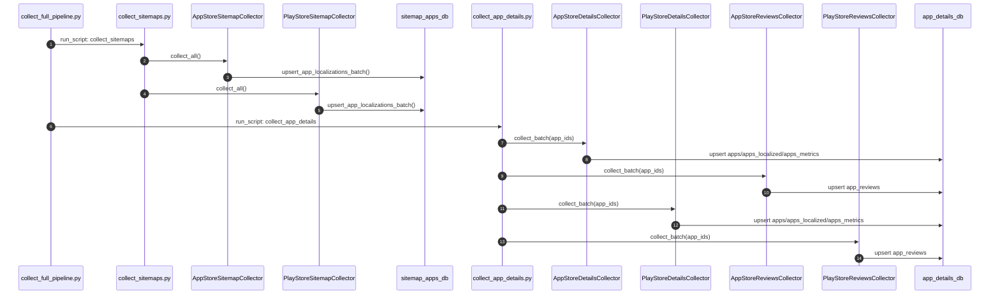

# NewApps - 앱 스토어 데이터 수집 시스템

App Store와 Google Play Store에서 앱 정보, 로컬라이제이션 데이터, 상세정보 및 리뷰를 자동으로 수집하는 시스템입니다.

## 프로젝트 개요 (한 줄 요약)

App Store/Play Store의 sitemap과 공개 API를 기반으로 전 세계 앱의 다국어 상세정보·리뷰를 자동 수집해 분석 가능한 DB로 적재하는 파이프라인입니다.

### 주요 기능

- **Sitemap 기반 앱 발견**: App Store/Play Store의 sitemap에서 앱 ID 및 다국어 로컬라이제이션 정보 수집
- **앱 상세정보 수집**: iTunes API 및 google-play-scraper를 통한 메타데이터, 수치 데이터 수집
- **다국어 데이터 수집**: 우선순위 기반 언어-국가 조합으로 효율적인 다국어 데이터 수집
- **리뷰 수집**: App Store RSS 피드 및 Play Store 스크레이퍼를 통한 사용자 리뷰 수집
- **시계열 데이터 관리**: 변경 시에만 새 레코드를 추가하여 시간에 따른 변화 추적
- **중복 방지**: MD5 해시 기반 sitemap 파일 변경 감지 및 중복 데이터 방지
- **데몬 모드**: systemd 서비스로 지속적인 자동 수집 운영

## 프로젝트 구조

```
newapps/
├── AGENT.MD                     # 개발 지침
├── README.md                    # 이 파일
└── backend/
    ├── collect_sitemaps.py              # Sitemap 수집 메인 스크립트
    ├── collect_app_details.py           # 상세정보/리뷰 수집 메인 스크립트
    ├── collect_full_pipeline.py         # 전체 파이프라인 실행 (메인 진입점)
    ├── collect-pipeline.service         # systemd 서비스 파일
    ├── requirements.txt                 # Python 의존성
    ├── test_comprehensive.py            # 종합 테스트 스크립트
    ├── test_long_running.py             # 장시간 수집 시뮬레이션 테스트
    │
    ├── config/
    │   └── language_country_priority.py # 언어-국가 우선순위 설정
    │
    ├── database/
    │   ├── sitemap_apps_db.py           # Sitemap 앱 DB
    │   └── app_details_db.py            # 상세정보 DB
    │
    ├── scrapers/
    │   ├── sitemap_utils.py             # Sitemap 파싱 유틸리티
    │   ├── collection_utils.py          # 공통 수집 유틸/재시도 로직
    │   ├── app_store_sitemap_collector.py
    │   ├── play_store_sitemap_collector.py
    │   ├── app_store_details_collector.py
    │   ├── play_store_details_collector.py
    │   ├── app_store_reviews_collector.py
    │   └── play_store_reviews_collector.py
    │
    ├── utils/
    │   ├── logger.py                    # 타임스탬프 로깅 유틸
    │   ├── network_binding.py           # 네트워크 인터페이스 관리
    │   └── error_tracker.py             # 예외 추적/에러 누적
    │
    ├── scripts/
    │   └── normalize_app_dates.py       # 날짜 정규화 스크립트
    │
    └── logs/                            # 로그 파일 디렉토리
```

---

## AWS EC2 신규 셋업 (Ubuntu 22.04/24.04)

아래 명령어를 순서대로 복사하여 붙여넣으세요.

### 1. 시스템 패키지 설치

```bash
sudo apt update && sudo apt install -y python3 python3-venv python3-pip postgresql postgresql-contrib
sudo systemctl enable --now postgresql
```

### 2. PostgreSQL 데이터베이스 생성

```bash
sudo -u postgres psql <<'SQL'
CREATE USER app_details WITH PASSWORD 'your_app_details_password';
CREATE USER sitemap_apps WITH PASSWORD 'your_sitemap_apps_password';
CREATE DATABASE app_details OWNER app_details;
CREATE DATABASE sitemap_apps OWNER sitemap_apps;
GRANT ALL PRIVILEGES ON DATABASE app_details TO app_details;
GRANT ALL PRIVILEGES ON DATABASE sitemap_apps TO sitemap_apps;
SQL
```

### 3. 프로젝트 클론 및 가상환경 설정

```bash
cd /home/ubuntu/newapps/backend

# 가상환경 생성 및 활성화
python3 -m venv .venv
source .venv/bin/activate

# 의존성 설치
pip install --upgrade pip
pip install -r requirements.txt
```

### 4. 환경 변수 설정

```bash
# 시스템 전역 환경 변수 파일 생성
sudo tee /etc/newapps.env > /dev/null <<'EOF'
# App Details DB
APP_DETAILS_DB_HOST=localhost
APP_DETAILS_DB_PORT=5432
APP_DETAILS_DB_NAME=app_details
APP_DETAILS_DB_USER=app_details
APP_DETAILS_DB_PASSWORD=your_app_details_password

# Sitemap DB
SITEMAP_DB_HOST=localhost
SITEMAP_DB_PORT=5432
SITEMAP_DB_NAME=sitemap_apps
SITEMAP_DB_USER=sitemap_apps
SITEMAP_DB_PASSWORD=your_sitemap_apps_password

# 월별 파티션 설정 (선택)
APP_DETAILS_MONTHLY_PARTITION_CHECK=true
APP_DETAILS_MONTHLY_PARTITION_ENFORCE=true
EOF

# 권한 설정
sudo chmod 644 /etc/newapps.env
```

### 5. 데이터베이스 초기화

```bash
cd /home/ubuntu/newapps/backend
source .venv/bin/activate
set -a && source /etc/newapps.env && set +a

# DB 스키마 생성
python -c "from database.app_details_db import init_database; init_database()"
python -c "from database.sitemap_apps_db import init_database; init_database()"
```

### 6. 테스트 실행

```bash
cd /home/ubuntu/newapps/backend
source .venv/bin/activate
set -a && source /etc/newapps.env && set +a

# 제한된 앱 수로 테스트
python collect_full_pipeline.py --limit 10
```

---

## 실행 방법

### 환경 변수 로드 (모든 수동 실행 전 필수)

```bash
cd /home/ubuntu/newapps/backend
source .venv/bin/activate
set -a && source /etc/newapps.env && set +a
```

### 단일 실행 (수동)

```bash
# 전체 파이프라인 실행 (사이트맵 → 상세정보 → 리뷰)
python collect_full_pipeline.py

# 앱 개수 제한하여 실행
python collect_full_pipeline.py --limit 100

# 테스트 포함 실행
python collect_full_pipeline.py --run-tests
```

### 개별 스크립트 실행

```bash
# === Sitemap 수집 ===
python collect_sitemaps.py              # 모든 스토어
python collect_sitemaps.py --app-store  # App Store만
python collect_sitemaps.py --play-store # Play Store만
python collect_sitemaps.py --stats      # 통계 출력

# === 상세정보/리뷰 수집 ===
python collect_app_details.py                # 모든 스토어
python collect_app_details.py --app-store    # App Store만
python collect_app_details.py --play-store   # Play Store만
python collect_app_details.py --details-only # 상세정보만
python collect_app_details.py --reviews-only # 리뷰만
python collect_app_details.py --limit 100    # 앱 개수 제한
python collect_app_details.py --stats        # 통계 출력
```

---

## 데몬 모드 (systemd 서비스)

파이프라인을 시스템 서비스로 등록하여 지속적으로 실행합니다.

**특징:**
- 모든 단계 완료 후 10초 대기 후 자동 재시작
- 시스템 부팅 시 자동 시작
- 비정상 종료 시 30초 후 자동 재시작
- SIGTERM 시그널로 Graceful Shutdown (현재 작업 완료 후 종료)

### 데몬 모드 수동 테스트

```bash
cd /home/ubuntu/newapps/backend
source .venv/bin/activate
set -a && source /etc/newapps.env && set +a

# 데몬 모드로 실행 (Ctrl+C로 정상 종료 테스트)
python collect_full_pipeline.py --daemon

# 대기 시간 변경 (기본 10초)
python collect_full_pipeline.py --daemon --interval 60
```

### systemd 서비스 등록

```bash
# 1. 서비스 파일 복사
sudo cp /home/ubuntu/newapps/backend/collect-pipeline.service /etc/systemd/system/

# 2. 서비스 파일에 환경 변수 파일 설정
sudo sed -i 's|# EnvironmentFile=.*|EnvironmentFile=/etc/newapps.env|' /etc/systemd/system/collect-pipeline.service

# 3. systemd 리로드
sudo systemctl daemon-reload

# 4. 서비스 시작
sudo systemctl start collect-pipeline

# 5. 부팅 시 자동 시작 설정
sudo systemctl enable collect-pipeline

# 6. 상태 확인
sudo systemctl status collect-pipeline
```

### 서비스 관리 명령어

```bash
# 상태 확인
sudo systemctl status collect-pipeline

# 로그 확인 (실시간)
sudo journalctl -u collect-pipeline -f

# 로그 확인 (최근 100줄)
sudo journalctl -u collect-pipeline -n 100

# 서비스 중지 (Graceful Shutdown - 현재 작업 완료 후 종료)
sudo systemctl stop collect-pipeline

# 서비스 재시작
sudo systemctl restart collect-pipeline

# 서비스 비활성화 (부팅 시 자동 시작 해제)
sudo systemctl disable collect-pipeline
```

---

## cron을 이용한 주기적 실행 (대안)

데몬 모드 대신 cron으로 주기적 실행도 가능합니다.

```bash
# 매일 새벽 2시에 실행
sudo tee /etc/cron.d/newapps > /dev/null <<'CRON'
SHELL=/bin/bash
PATH=/usr/local/sbin:/usr/local/bin:/usr/sbin:/usr/bin:/sbin:/bin

0 2 * * * ubuntu cd /home/ubuntu/newapps/backend && source /etc/newapps.env && /home/ubuntu/newapps/backend/.venv/bin/python collect_full_pipeline.py >> /var/log/newapps-cron.log 2>&1
CRON

sudo chmod 644 /etc/cron.d/newapps
```

---

## 환경 변수 레퍼런스

| 변수명 | 필수 | 기본값 | 설명 |
|--------|:----:|--------|------|
| `APP_DETAILS_DB_HOST` | - | `localhost` | App Details DB 호스트 |
| `APP_DETAILS_DB_PORT` | - | `5432` | App Details DB 포트 |
| `APP_DETAILS_DB_NAME` | - | `app_details` | App Details DB 이름 |
| `APP_DETAILS_DB_USER` | - | `app_details` | App Details DB 사용자 |
| `APP_DETAILS_DB_PASSWORD` | O | - | App Details DB 비밀번호 |
| `APP_DETAILS_DB_DSN` | - | - | PostgreSQL DSN (설정 시 개별 변수보다 우선) |
| `SITEMAP_DB_HOST` | - | `localhost` | Sitemap DB 호스트 |
| `SITEMAP_DB_PORT` | - | `5432` | Sitemap DB 포트 |
| `SITEMAP_DB_NAME` | - | `sitemap_apps` | Sitemap DB 이름 |
| `SITEMAP_DB_USER` | - | `sitemap_apps` | Sitemap DB 사용자 |
| `SITEMAP_DB_PASSWORD` | O | - | Sitemap DB 비밀번호 |
| `APP_DETAILS_DB_CONNECT_MAX_RETRIES` | - | `5` | DB 연결 재시도 횟수 |
| `APP_DETAILS_DB_CONNECT_RETRY_DELAY_SEC` | - | `2.0` | 재시도 대기 시간 (초) |
| `APP_DETAILS_DB_REUSE_CONNECTION` | - | `true` | DB 연결 재사용 여부 |
| `APP_DETAILS_MONTHLY_PARTITION_CHECK` | - | `true` | 월별 파티션 자동 생성 여부 |
| `APP_DETAILS_MONTHLY_PARTITION_ENFORCE` | - | `true` | 파티션 생성 실패 시 중단 여부 |

---

## 핵심 로직 흐름

1. **Sitemap 수집 시작 (`collect_sitemaps.py`)**
   - App Store/Play Store의 sitemap index를 순회해 개별 sitemap URL을 수집합니다.
   - 각 sitemap 파일을 다운로드하고 MD5 해시를 계산해 기존 해시와 비교합니다.
   - 변경된 sitemap만 파싱하여 앱 ID, 언어, 국가 코드를 추출합니다.
   - 언어별 우선 국가만 남기고 `sitemap_apps` DB에 upsert합니다.

2. **상세정보/리뷰 수집 시작 (`collect_app_details.py`)**
   - `sitemap_apps`에서 수집 대상 앱을 조회합니다.
   - App Store는 iTunes Lookup API, Play Store는 `google-play-scraper`로 메타데이터/수치/리뷰를 수집합니다.
   - 최신 레코드와 비교해 변경된 데이터만 `app_details` DB에 시계열로 저장합니다.

3. **통합 파이프라인 (`collect_full_pipeline.py`)**
   - 월별 파티션을 점검/생성한 뒤 sitemap 수집 → 상세정보/리뷰 수집 → (옵션) 테스트 순으로 실행합니다.
   - 데몬 모드(`--daemon`)에서는 완료 후 10초 대기 후 처음부터 재시작합니다.

## 전체 로직 시퀀스 다이어그램



## 첫 번째 실행 vs 두 번째 실행 차이

- **첫 번째 실행(초기 수집)**
  - sitemap index 전체를 다운로드해 각 sitemap 파일의 MD5 해시를 DB에 기록합니다.
  - 앱 로컬라이제이션이 비어 있으므로 대부분의 앱이 신규로 `sitemap_apps`에 저장됩니다.
  - 상세정보/리뷰 수집 단계에서는 모든 앱이 신규이므로 메타데이터와 리뷰가 대량으로 적재됩니다.

- **두 번째 실행(증분 수집)**
  - sitemap 파일의 MD5 해시가 동일하면 해당 파일은 **스킵**되어 네트워크/파싱 비용을 줄입니다.
  - 변경된 sitemap만 로컬라이제이션이 갱신되고, 상세정보/리뷰도 변경이 있는 앱만 시계열로 추가됩니다.
  - 결과적으로 전체 실행 시간과 DB 쓰기가 크게 감소합니다.

---

## 데이터베이스 스키마

### sitemap_apps (PostgreSQL)

앱 로컬라이제이션 정보를 저장합니다.

#### sitemap_files
| 컬럼 | 타입 | 설명 |
|------|------|------|
| id | INTEGER | PK |
| platform | TEXT | 플랫폼 (app_store/play_store) |
| file_url | TEXT | sitemap 파일 URL |
| md5_hash | TEXT | 파일 MD5 해시 (변경 감지용) |
| last_collected_at | TEXT | 마지막 수집 시각 |
| app_count | INTEGER | 해당 파일의 앱 수 |

#### app_localizations
| 컬럼 | 타입 | 설명 |
|------|------|------|
| id | INTEGER | PK |
| platform | TEXT | 플랫폼 |
| app_id | TEXT | 앱 ID |
| language | TEXT | 언어 코드 (ko, en 등) |
| country | TEXT | 국가 코드 (kr, us 등) |
| href | TEXT | 해당 로컬라이제이션 URL |
| source_file | TEXT | 수집된 sitemap 파일명 |
| first_seen_at | TEXT | 처음 발견 시각 |
| last_seen_at | TEXT | 마지막 발견 시각 |

### app_details (PostgreSQL)

앱 상세정보, 수치 데이터, 리뷰를 저장합니다. 모든 테이블은 Hash 파티셔닝 (64개)으로 구성됩니다.

#### apps (시계열)
앱 메타데이터. 변경 시에만 새 레코드가 추가됩니다.

| 컬럼 | 타입 | 설명 |
|------|------|------|
| app_id | TEXT | 앱 ID |
| platform | TEXT | 플랫폼 |
| bundle_id | TEXT | 번들 ID |
| version | TEXT | 앱 버전 |
| developer | TEXT | 개발자명 |
| price | REAL | 가격 |
| category_id | TEXT | 카테고리 ID |
| release_date | TEXT | 출시일 |
| updated_date | TEXT | 업데이트일 |
| recorded_at | TEXT | 기록 시각 |

#### apps_localized (시계열)
다국어 텍스트 데이터.

| 컬럼 | 타입 | 설명 |
|------|------|------|
| app_id | TEXT | 앱 ID |
| language | TEXT | 언어 코드 |
| title | TEXT | 앱 제목 |
| summary | TEXT | 요약 |
| description | TEXT | 설명 |
| release_notes | TEXT | 릴리스 노트 |

#### apps_metrics (시계열)
수치 데이터.

| 컬럼 | 타입 | 설명 |
|------|------|------|
| app_id | TEXT | 앱 ID |
| score | REAL | 평점 |
| ratings | INTEGER | 평가 수 |
| reviews_count | INTEGER | 리뷰 수 |
| installs | TEXT | 설치 수 (Play Store) |
| installs_exact | BIGINT | 정확한 설치 수 |
| histogram | TEXT | 점수 분포 JSON |

#### app_reviews
사용자 리뷰.

| 컬럼 | 타입 | 설명 |
|------|------|------|
| app_id | TEXT | 앱 ID |
| review_id | TEXT | 외부 리뷰 ID (중복 방지) |
| user_name | TEXT | 작성자 |
| score | INTEGER | 평점 (1-5) |
| title | TEXT | 리뷰 제목 (App Store) |
| content | TEXT | 리뷰 내용 |
| reviewed_at | TEXT | 작성 시각 |
| reply_content | TEXT | 개발자 답변 |
| replied_at | TEXT | 답변 시각 |

#### collection_status
수집 상태 추적.

| 컬럼 | 타입 | 설명 |
|------|------|------|
| app_id | TEXT | 앱 ID |
| platform | TEXT | 플랫폼 |
| details_collected_at | TEXT | 상세정보 마지막 수집 시각 |
| reviews_collected_at | TEXT | 리뷰 마지막 수집 시각 |
| reviews_total_count | INTEGER | 수집된 총 리뷰 수 |
| initial_review_done | INTEGER | 최초 수집 완료 여부 |

#### failed_apps
실패한 앱 관리.

| 컬럼 | 타입 | 설명 |
|------|------|------|
| app_id | TEXT | 앱 ID |
| platform | TEXT | 플랫폼 |
| reason | TEXT | 실패 사유 |
| is_permanent | BOOLEAN | 영구 실패 여부 |
| consecutive_fail_count | INTEGER | 연속 실패 횟수 |

---

## 로그 확인

```bash
# 로그 디렉토리
ls -la /home/ubuntu/newapps/backend/logs/

# 최신 파이프라인 로그 확인
tail -f /home/ubuntu/newapps/backend/logs/collect_full_pipeline_*.log

# 특정 날짜 로그 확인
cat /home/ubuntu/newapps/backend/logs/collect_full_pipeline_20250122.log

# systemd 서비스 로그 (데몬 모드)
sudo journalctl -u collect-pipeline -f
```

---

## 트러블슈팅

### DB 연결 실패

```bash
# PostgreSQL 상태 확인
sudo systemctl status postgresql

# PostgreSQL 재시작
sudo systemctl restart postgresql

# 연결 테스트
psql -h localhost -U app_details -d app_details -c "SELECT 1"
```

### systemd 서비스가 시작되지 않을 때

```bash
# 상세 로그 확인
sudo journalctl -u collect-pipeline -n 50 --no-pager

# 수동으로 실행하여 오류 확인
cd /home/ubuntu/newapps/backend
source .venv/bin/activate
set -a && source /etc/newapps.env && set +a
python collect_full_pipeline.py --daemon
```

### 권한 오류

```bash
# 디렉토리 소유권 확인
ls -la /home/ubuntu/newapps/

# 소유권 수정
sudo chown -R ubuntu:ubuntu /home/ubuntu/newapps
```

### 환경 변수가 로드되지 않을 때

```bash
# 환경 변수 파일 확인
cat /etc/newapps.env

# 환경 변수 로드 확인
set -a && source /etc/newapps.env && set +a
echo $APP_DETAILS_DB_PASSWORD
```

---

## 성능 최적화

### MD5 해시 기반 변경 감지
- sitemap 파일의 MD5 해시를 저장하여 변경된 파일만 재처리
- 불필요한 네트워크 요청 및 DB 업데이트 방지

### 시계열 데이터 중복 방지
- 새 데이터와 최신 레코드를 비교하여 변경 시에만 삽입
- 저장 공간 절약 및 의미 있는 변화만 기록

### 언어-국가 최적화
- 각 언어당 가장 큰 시장의 국가 데이터만 수집
- 중복 언어 데이터 수집 방지

### 버려진 앱 최적화
- 2년 이상 업데이트되지 않은 앱은 7일에 1회만 수집
- 영구 실패 앱은 수집 대상에서 제외

---

## 의존성

- Python 3.10+
- PostgreSQL 14+

```
requests>=2.31.0
google-play-scraper>=1.2.4
psycopg[binary]>=3.1.18
```

---

## 테스트

```bash
cd /home/ubuntu/newapps/backend
source .venv/bin/activate

# 단위 테스트
python -m pytest

# 커버리지 포함
python -m pytest --cov=. --cov-report=term-missing

# 종합 테스트
python test_comprehensive.py
```

---

## 제한사항

- **App Store**: iTunes Lookup API 사용 (공식 API, 속도 제한 있음)
- **Play Store**: 비공식 스크레이퍼 사용 (정책 변경에 취약)
- **리뷰**: 실행당 최대 20,000건으로 제한 (무한 루프 방지)
- **데몬 모드**: 강제 종료 시 현재 진행 중인 작업은 완료 후 종료

---

## 라이선스

이 프로젝트는 내부 사용 목적으로 제작되었습니다.
